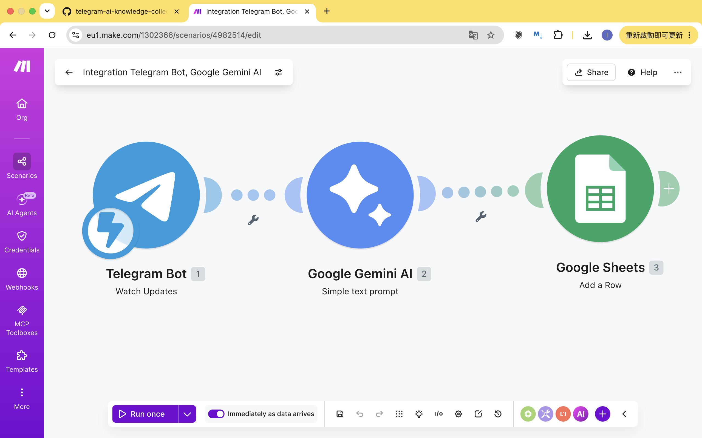

# 🧠 Telegram AI Knowledge Collector

## 📖 Background
In the era of information explosion, we receive a massive amount of fragmented information daily across various social media platforms (X, Threads, Telegram). Traditional bookmarking or copy-pasting methods are not only inefficient but also lack subsequent systematic organization and AI analysis. 

This project aims to build a "Zero-friction" knowledge capture system tailored for personal learners, AI Product Managers, and Digital Transformation Consultants.

## 🎯 Pain Points Solved
* **Information Overload:** Forward high-value content from social media with a single click, eliminating the tediousness of manual organization.
* **Lack of Focus:** Utilize Large Language Models (LLM) to automatically extract core summaries and action items from long articles or web links.
* **Knowledge Silos:** Centralize all scattered information into a structured database (Google Sheets), facilitating seamless future integration into Zettelkasten note-taking systems like Obsidian.

## ⚙️ Architecture & Tools
This project utilizes a No-Code architecture for rapid development and deployment:
* **Input Node:** Telegram Bot API (Acts as a unified receiving interface)
* **Core Logic:** Make.com (Handles Webhook listening and workflow automation)
* **AI Processing:** Google Gemini 1.5 Pro API (Responsible for content summarization and tagging)
* **Database:** Google Workspace / Google Sheets (Structured data storage)

## 🚀 Workflow
1. The user forwards valuable articles, links, or images to the dedicated Telegram Bot via their mobile device.
2. Make.com is triggered via a Webhook and parses the incoming Telegram message format.
3. The extracted text is routed to the Gemini API with a specific prompt to generate a "Core Summary" and identify potential "Action Items."
4. The processed, structured data is automatically appended to designated columns in Google Sheets.

## 📥 How to Deploy
1. Register for a free [Make.com](https://www.make.com/) account.
2. Create a new Scenario, click `More` (the three dots at the bottom menu) -> `Import Blueprint`.
3. Import the `telegram-knowledge-collector-blueprint.json` file from this repository.
4. Sequentially authorize and fill in your personal Telegram Bot Token, Google AI Studio API Key, and Google Sheets connection.
5. Turn the Scenario to `ON`, and your automated knowledge assistant is ready to use!

## 👤 About Me
**Matthew Lam**
*AI Product Manager | Digital Transformation Consultant*
* Focusing on NGO digital transformation, workflow automation, and the practical implementation of AI applications.
